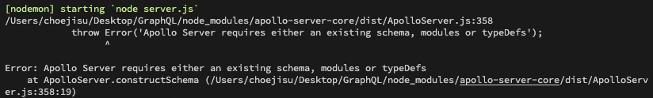
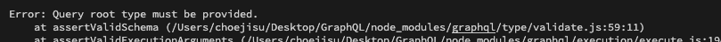

# 💥 TroubleShooting

## 'Apollo Server requires either an existing schema, modules or typeDefs'



Why?

> GraphQL이 data의 shape (like schema) 을 미리 알고 있어야 하기 때문에 발생

So?

> data의 shape을 GraphQL에게 설명해주면 된다.

```javascript
const typeDefs = gql`
  type sth {
    text: String
  }
`;
```

## 'Query root type must be provided.'



Why?

> `Query` type은 필수적이다. Query type 없이는 server가 시작하지 않는다.

So?

```javascript
const typeDefs = gql`
  type Query {
    name: String
    age: Int
  }
`;
```

=> request 요청을 할 모든 것은  반.드.시. `Query` type 내에 있어야 한다.  
예를 들어 위 코드와 같은 경우 REST API의 `'GET /name'`, ` 'GET /age'`와 같이 볼 수 있다.
