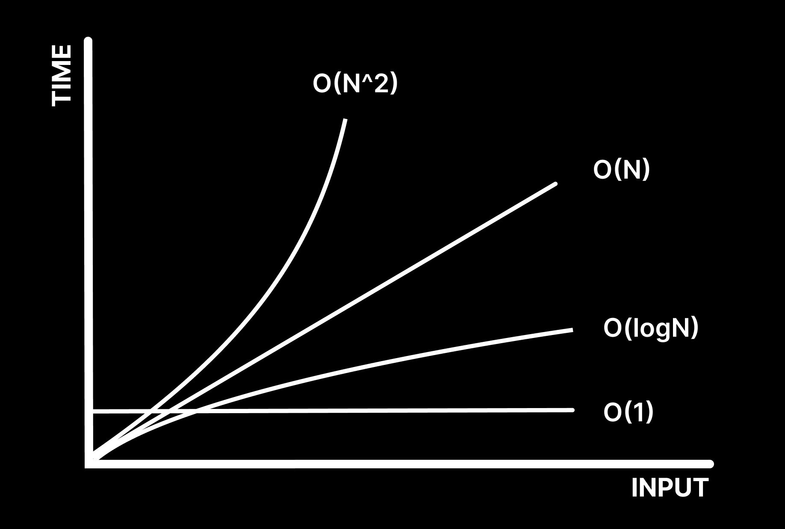

# Big-O

> 최악의 경우를 고려한 시간 복잡도 표기법이다.

    ex) O(N): 최악일 경우 N번까지 수행된 후 프로그램을 끝낼 수 있다.



## 1. Constant Time - O(1)

```javascript
const arr = [0, 1, 2];

console.log(arr[0]);
console.log(arr[0]);
```

input size에 관계없이, step이 정해진 알고리즘들의 시간복잡도.  
미리 정해져 있는 상수는 시간복잡도에 관여하지 않는다.  
즉, 몇 번을 출력하더라도 O(1)이다.

## 2. Linear Time(Search) - O(N)

```javascript
const arr = [0, 1, 2];

for (let i = 0; i < arr.length; i++) console.log(arr[i]);
```

input size가 증가함에 따라 step도 증가하는 알고리즘의 시간복잡도.  
선형 검색 알고리즘 등에 해당한다.  
만약 for문을 두 번 처리한다고 가정했을 때, O(2N)으로 생각할 수 있지만 시간복잡도에서 상수는 무시하기 때문에 O(N)으로 표시한다.

## 3. Quadratic Time - O(N^2)

```javascript
const arr = [0, 1, 2];

for (let i = 0; i < arr.length; i++) {
  for (let j = 0; j < arr.length; j++) console.log(arr[j]);
}
```

주로 Nested Loops(중첩 반복)이 있을 때 발생한다.

## 4. Logarithmic Time - O(logN)

예를 들어 `n = log2(32)`이 주어졌을 때 32를 2로 5번을 나누면 1이 나온다는 사실을 통해 n이 5라는 것을 알 수 있다. 이렇게 매 step마다 이분을 하며 검색해나가는 방식을 보았을 때 주로 이진검색 알고리즘에 사용될 것이라는 것을 알 수 있다.  
검색 대상이 두배로 늘더라도 step은 단 1만 증가하는 것이다.  
하지만 정렬된 배열에서만 사용할 수 있다는 걸 주의해야한다.

[참고 강의](https://www.youtube.com/watch?v=BEVnxbxBqi8&list=PL7jH19IHhOLMdHvl3KBfFI70r9P0lkJwL&index=4&ab_channel=%EB%85%B8%EB%A7%88%EB%93%9C%EC%BD%94%EB%8D%94NomadCoders)
