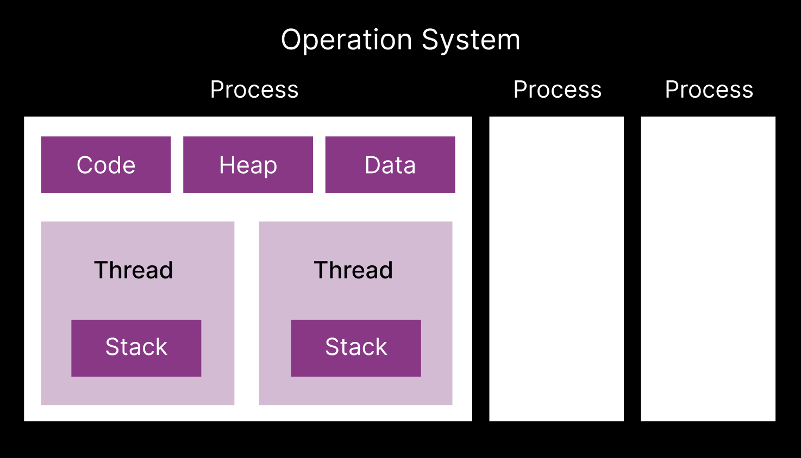
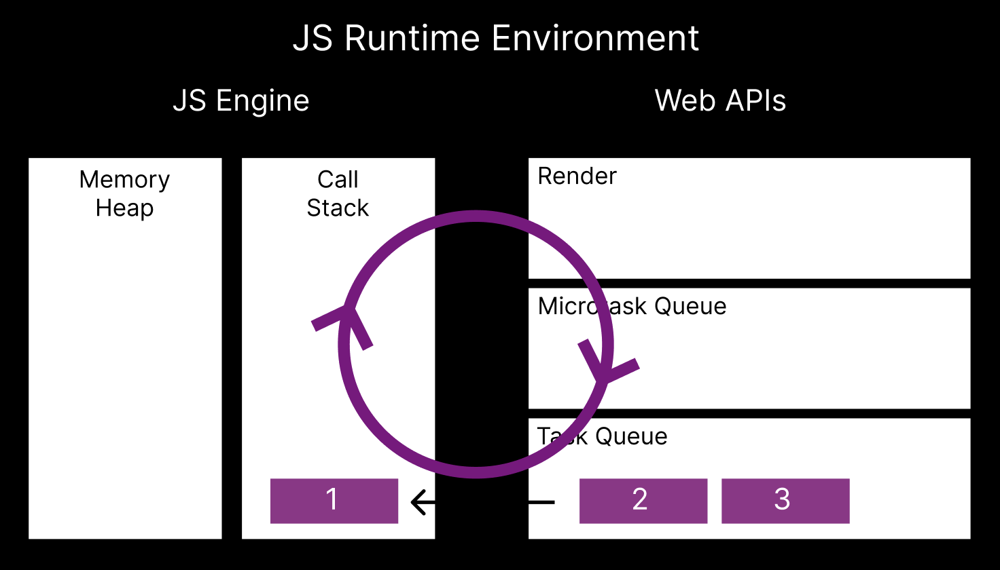

# JS Runtime Environment

## Process & Thread

> 본격적으로 JS 런타임 환경에 대해 살펴보기 전 프로세스와 스레드에 대해 살펴보자.

 

### 프로세스(Process)

> 프로세스란 연속적으로 실행되고 있는 프로그램을 뜻한다.

|               | Operation System (ios) |               |
| :-----------: | :--------------------: | :-----------: |
| Process1(앱1) |     Process2(앱2)      | Process3(앱3) |
|     Code      |          Code          |     Code      |
|     Stack     |         Stack          |     Stack     |
|     Heap      |          Heap          |     Heap      |
|     Data      |          Data          |     Data      |

만약 휴대폰을 사용하던 중 한 어플리케이션이 동작하지 않을 때 프로세스에 문제가 생겼다고 표현한다. 하지만 한 어플리케이션이 동작하지 않는다고 다른 어플리케이션들이 문제가 생기진 않는다.

따라서 `프로세스는 운영체제 위에서 독립적으로 메모리에서 실행되고 있는 프로그램`을 말한다.

각각의 프로세스들은 리소스(자원)가 한정되어 있는데, 프로세스마다 할당된 메모리나 데이터들이 지정되어 있다. 프로세스는 `프로그램을 실행하기 위한 Code`, `Code 내 함수들의 실행 순서 등의 정보가 저장되어 있는 Stack`, `Object를 생성하거나 데이터를 만들 때 데이터들이 저장되는 Heap(주로 동적으로 할당된 변수들이 저장된다.)`, `global 변수나 static 변수가 할당되는 Data`로 이루어져있다.

### 스레드(Thread)

> 프로세스는 여러 개의 스레드를 가질 수 있는데, 각각의 스레드는 저마다의 업무를 가지고 있다.

예를 들어, 음악 어플리케이션에서 음악을 재생하는 스레드, 서버에서 데이터를 받아오는 스레드, 음악을 기준에 따라 정렬하는 스레드 등 여러 스레드가 존재한다. 이를 멀티 스레드(Multi Thread)이라 하며 멀티스레딩을 함으로써 한 프로세스 내에서 다양한 일을 동시에 할 수 있다.

각 스레드는 각각 Stack을 가지고, Code, Heap, Data에 대해서는 여러 스레드가 동시에 접근(공유)한다.

 

`그렇다면 JS는 어떻게 동작할까?`

> JS는 `Single Threaded Language`이다.

그렇다면 어떻게 브라우저 상에서 동시 다발적으로 여러가지 일을 할 수 있었던 걸까?

답은 브라우저에 있다.

JS가 동작하는 브라우저에는 여러 스레드가 존재한다.(WebAPI들을 사용해 멀티쓰레딩을 할 수 있다.)

 

## JS Runtime Environment

> JS 런타임환경은 JS 엔진과 WebAPIs로 이루어져 있다.

### JS Engine

> JS 엔진은 크게 Memory Heap과 Call Stack으로 이루어져있다.

`Memory Heap`

Process의 Heap처럼 JS 엔진의 Memory Heap에도 Object를 생성하거나 변수에 값을 할당할 때 등에 생기는 데이터들을 저장한다.

`Call Stack`

Call Stack에는 함수가 호출(실행)되는 순서대로 쌓이고 함수 종료 후 돌아가야 할 위치 또한 저장하고 있어 stack의 LIFO(Last Int First Out)에 따라 함수 실행이 진행된다.

### WebAPIs

> JS엔진에서 함수를 콜스택에 따라 실행하고 있는 것을 알아보았다.  
> 그렇다면 데이터를 불러오는 fetch나 setTimeout 등의 WebAPIs를 실행할 때 이들의 실행 순서도 콜스택에서 관리하는 걸까?

WebAPIs의 콜백함수는 Task Queue에서 우선 관리하고 이벤트루프에 의해 콜스택으로 넘어가 관리된다.

setTimeout, fetch, eventListener 등 WebAPIs의 등록된 콜백함수를 지정된 시간에 알아서 Task Queue에 넣어주고 FIFO(First In First Out)에 따라 실행된다.

Task Queue와 Call Stack의 함수들은 병렬적으로 처리되어야 하는데, 이를 위해 Task Queue와 Call Stack을 계속 관찰하고 있는 `Event Loop`가 존재한다.

`Event Loop`  
이벤트 루프는 프로세스가 실행되는 동안 while이나 for문 등을 계속 돌면서 콜스택, 렌더, 마이크로테스크큐, 테스크큐를 관찰한다.  
만약 콜스택에 처리할 콜백함수들이 남아있다면 모두 실행되고 콜스택이 비워질 때까지 기다린다.  
콜스택이 비워져 더이상 JS엔진이 일을 하고 있지 않으면 그 때 테스크큐에 있는 콜백함수를 콜스택으로 옮겨 JS엔진이 작업을 할 수 있도록 돕는다.

테스크큐에서 콜스택으로 옮겨진 콜백함수가 작업완료가 되고 콜스택이 비워져야 그 다음 테스크큐의 콜백함수가 콜스택으로 옮겨질 수 있다.

## Microtask Queue

> 마이크로테스크큐에는 프로미스 수행 후 등록된 콜백함수(then에)와 WebAPI 중 mutation observer(fetch 후 resolve 되었을 때의 콜백 함수 등)에 등록된 콜백함수가 등록된다.

이벤트루프는 `콜스택 -> 렌더 -> 마이크로테스크 큐 -> 테스크 큐 -> 콜스택`을 돌며 동작하는데, 먼저 만나게 되는 만큼 테스크 큐보다 먼저 마이크로테스크 큐에 있는 콜백함수들을 콜스택으로 하나씩 옮기며 동작한다. 마이크로테스크 큐의 콜백함수를 처리하는 동안 마이크로테스크 큐에 계속 해서 콜백함수가 새로 생기면 그것까지 모두 처리한 후 테스크 큐로 이동하기 때문에 `마이크로테스크 큐에 작업이 계속 존재하는 한 이벤트루프는 테스크큐로 이동하지 못한다`.

[참고 강의](https://academy.dream-coding.com/courses/take/browser101/lessons/14138005-10-2)
