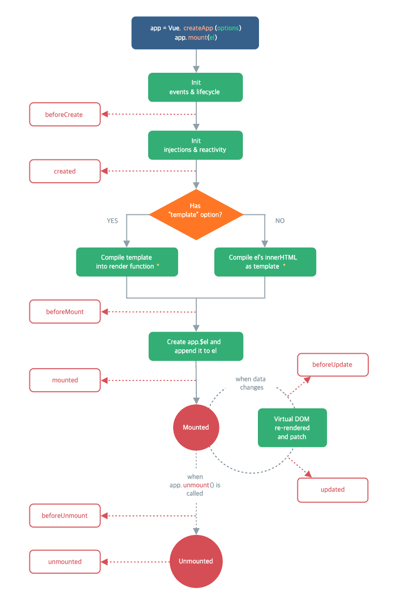
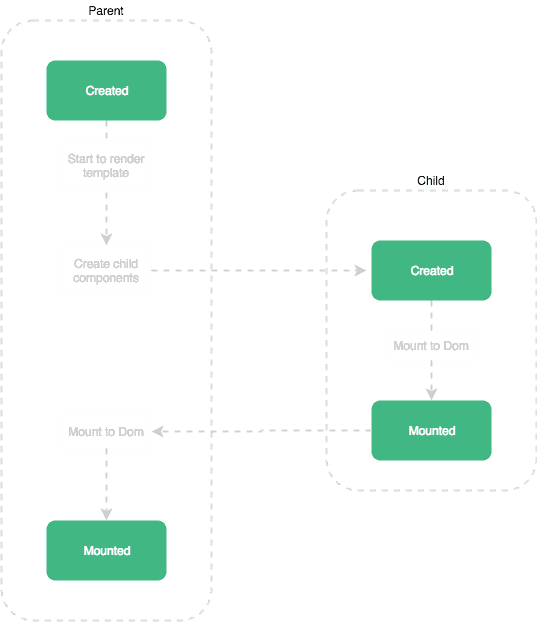

# Vue Lifecycle Hooks

> Vue instance는 크게 `Creation(생성)`, `Mounting(장착)`, `Updating(수정)`, `Unmounting(소멸)` 단계를 거치게 되는데, Vue는 이 각각의 단계에서 사용할 수 있는 Hook APIs를 제공한다.

> 모든 lifecycle hook은 자동으로 `this context` 가 instance에 binding되어있기 때문에, data, computed, methods 등의 property에 접근할 수 있다.



### beforeCreate

- instance가 초기화 된 직후에 호출된다.
- component가 DOM에 mount 되기 전이기 때문에 data, methods, event, watcher 등 접근할 수 없다. (접근 시 에러 발생)

  ```jsx
  // App.vue

  <script>
  	export default {
  		beforeCreate() {
  			//
  		}
  	}
  </script>
  ```

  - 단순히 가장 빠르게 호출할 수 있는 hook이라는 점에서 상태값 초기화가 필요없다면 적절한 hook이다.

### created

- instance가 생성된 후 호출되며, data, computed, methods, watch, event callback 등의 설정이 준비되었다는 option 처리를 완료한다.
- 하지만 여전히 component가 mount 되기 전이기 때문에 `$el` 속성을 사용할 수는 없다.

  ```jsx
  // App.vue

  <script>
  	export default {
  		data() {
  			return {
  				msg: 'vue lifecycle'
  			}
  		},
  		methods: {
  			onClick() {
  				console.log('버튼 클릭');
  			}
  		},
  		created() {
  			// 데이터, 메서드 접근 시 에러 발생하지 않는다.
  			console.log(this.msg);
  			this.onClick();
  		}
  	}
  </script>
  ```

  - data()의 변수들과 event method 등이 활성화되어 접근 가능하다.
  - data에 직접 접근이 가능하기 때문에, `component 초기에 외부에서 받아온 값으로 data를 세팅해야하는 경우 (API 요청 등)` 또는 `event listener을 선언해야 하는 경우`에 created hook에서 하는 것이 좋다.
  - 예를 들어 비동기로 data를 가져와 상태값에 설정해야 한다면 `상태값은 beforeCreate와 created 사이에서 초기화`되기 때문에 created가 가장 빠른 lifecycle hook이 된다.

### beforeMount

- instance가 DOM에 장착(mount)되기 직전(가상 DOM이 생성되었지만 실제 DOM에는 부착되지 않은 상태)에 호출되는 hook으로, `<template>` 태그가 실행된 후 실행된다.
- 즉, template과 render function 들이 compile된 후, `첫 rendering이 일어나기 직전`에 실행된다.

  ```jsx
  // App.vue

  <script>
  	export default {
  		beforeMount() {
  			//
  		}
  	}
  </script>
  ```

  - 주로 초기 rendering 직전에 DOM을 변경하고자 할 때 beforeMount hook을 활용할 수 있다.

### mounted

- instance가 mount된 후 호출되는 hook으로, template과 rendering된 DOM에 접근할 수 있다.
- mounted hook은 일반적으로 가장 많이 사용하는 hook으로, this.$el을 비롯한 data, computed, methods, watch 등 모든 요소에 접근 가능하다.



- 일반적으로 부모와 자식 component 간의 mounted 순서는 위와 같다.
- 부모 component의 mounted hook은 항상 자식 component mounted hook 이후에 발생한다.
- 하지만, mounted가 모든 자식 component가 mount되었음을 보장하는 것은 아니다. (예를 들어, 자식 component가 server에서 비동기로 data를 받아오는 경우 등)
- 전체 화면내용이 rendering될 때까지 기다리기 위해서는 mounted 내의 `vm.$nextTick`을 사용해야 한다.

  ```jsx
  // App.vue

  <script>
  	export default {
  		mounted() {
  			this.$nextTick(function() {
  				// 전체 화면내용이 rendering 된 후 실행된다.
  			})
  		}
  	}
  </script>
  ```

### beforeUpdate

- component에서 사용되는 data의 값이 변해, 이를 DOM에도 적용시켜야 할 때 그 직전에 호출되는 hook이다.

  ```jsx
  // App.vue

  <script>
  	export default {
  		beforeUpdate() {
  			// 여기서 값을 변화시켜도 rerendering이 일어나지는 않는다.
  		}
  	}
  </script>
  ```

### updated

- component의 data가 변경되어 rerendering된 후(가상 DOM을 rendering하고 실제 DOM도 변경된 후) 호출되는 hook이다.
- 변경된 data를 DOM을 통해 접근하고 싶을 때 주로 사용된다.
- 하지만, 만약 updated hook에서 data를 변경한다면 무한 루프에 걸릴 수 있기 때문에 직접 data를 바꾸지 않는 것이 좋다. (데이터를 바꾸기 위해서는 computed property 또는 watcher를 사용하자)
- mounted hook에서와 마찬가지고, 모든 하위 component가 rerendering되었음을 보장하지는 않는다. 따라서 전체 화면이 rerendering 될 때까지 기다리기 위해서는 `vm.$nextTick`을 사용해야 한다.

  ```jsx
  // App.vue

  <script>
  	export default {
  		updated() {
  			this.$nextTick(function() {
  				// 전체 화면내용이 rerendering 된 후 실행된다.
  			})
  		}
  	}
  </script>
  ```

### beforeUnmount

- component가 소멸되기 직전에 호출되는 hook이다.
- component의 기본 모습과 기능은 그대로 가져가되, event 등을 제거할 경우에 활용할 수 있다.

  ```jsx
  // App.vue

  <script>
  	export default {
  		beforeUnmount() {
  			//
  		}
  	}
  </script>
  ```

### unmounted

- component가 소멸된 후 호출되는 hook이다.
- Vue의 모든 directive(HTML Element 안에 v- 접두어를 가진 attribute)가 binding 해제되고, 모든 event listener가 제거되며, 모든 하위 component도 소멸된다.

  ```jsx
  // App.vue

  <script>
  	export default {
  		unmounted() {
  			//
  		}
  	}
  </script>
  ```

---

추가로,,

**초기 rendering만 server측에서 수행되기 때문에,**

**beforeMount, mounted, beforeUpdate, updated, beforeUnmount, unmounted hook은 server측 rendering 중 호출되지 않는다.**

---

참고)

[https://v3.ko.vuejs.org/api/options-lifecycle-hooks.html](https://v3.ko.vuejs.org/api/options-lifecycle-hooks.html#beforemount)

[https://javascript.plainenglish.io/vue-lifecycle-hooks-75d296e7ef8](https://javascript.plainenglish.io/vue-lifecycle-hooks-75d296e7ef8)

[https://learnvue.co/tutorials/vue-lifecycle-hooks-guide](https://learnvue.co/tutorials/vue-lifecycle-hooks-guide)

[https://any-ting.tistory.com/42](https://any-ting.tistory.com/42)

[https://wormwlrm.github.io/2018/12/29/Understanding-Vue-Lifecycle-hooks.html](https://wormwlrm.github.io/2018/12/29/Understanding-Vue-Lifecycle-hooks.html)
