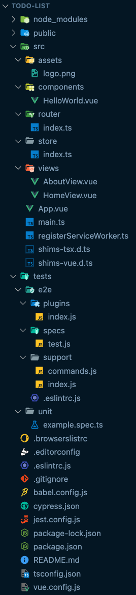

- node_modules 폴더: 프로젝트에 쓰이는 library들이 있는 디렉토리
- public 폴더: html, 기타 파일들이 있는 디렉토리
- src 폴더: 대부분의 소스 코드들이 있는 디렉토리
  - assets 폴더: font, icon, image 등 application에서 사용되는 asset 파일들이 있는 디렉토리
  - components 폴더: vue 컴포넌트 파일들이 있는 디렉토리
  - router 폴더: vue-router 설정을 하는 디렉토리
  - store 폴더: vue의 상태관리도구인 vuex모듈들이 있는 디렉토리
  - views 폴더: 주로 router를 통해 탐색하는 기본 페이지들에서 사용되는 컴포넌트 파일들이 있는 디렉토리
  - App.vue 파일: 최상위 컴포넌트 파일
  - main.ts 파일: application의 진입점으로, 최상위 컨테이너 뷰인 App.vue 파일을 로드 (웹 브라우저는 vue 파일을 해석할 수 없기 때문에 App.vue 코드를 불러와 이를 웹에서 실행되도록 함)
  - registerServiceWorker.ts 파일: 브라우저의 백그라운드에서 실행되는 JS 워커인 서비스워커(Service Worker) 설정 파일
    - 서비스워커: PWA(Progressive Web Application)가 오프라인 상태에서도 사용 가능하고, 푸시 알림 기능도 사용할 수 있도록 도와주는 것
  - shims-tsx.d.ts 파일: JSX-style의 TS 코드를 작성하기 위해 jsx 구문을 활성화 할 때 IDE에서 .tsx파일을 사용하는 것을 허용해주는 파일
  - shims-vue.d.ts 파일: 여러 파일 중 .vue로 끝나는 파일이 어떤 파일인지 IDE가 판단하기 쉽게 도와주는 파일
- tests 폴더
  - e2e 폴더: e2e 테스트 파일들이 있는 디렉토리
    - e2e 테스트: 실제 유저의 플로우를 따라 접속, 로그인, 구매하는 등 특정 루트나 시나리오가 있는 테스트
  - unit 폴더: unit 테스트 파일들이 있는 디렉토리
    - unit 테스트: 함수와 메소드에 대한 기능별 테스트(ex. 버튼 클릭)
- .browserslistrc 파일: 지원하고자 하는 브라우저들에 대한 설정을 하는 browserlist 설정 파일
- .editorconfig 파일: .NET에 대한 코드 스타일 설정을 지정하는 파일
- .eslintrc.js 파일: eslint 설정 파일
- .gitignore 파일: 특정 파일 또는 디렉토리를 관리 대상에서 제외할 때 사용하는 파일
- babel.config.js 파일: 개발자들이 실행 환경에 구애받지 않고 항상 최신 문법의 JS로 코딩할 수 있도록 도와주는 도구인 babel에 대한 환경설정 파일
- cypress.json 파일: 웹이 정상적으로 동작하는지 자동으로 테스트하는 기능을 제공하는 프론트엔드 테스트 도구인 cypress의 환경설정 파일
- jest.config.js 파일: JS 테스트 프레임워크인 jest 환경설정 파일
- package-lock.json 파일: 파일이 생성되는 시점의 의존성 트리에 대한 정보를 가지고 있는 파일로, npm을 사용해 “package.json” 또는 “node_modules” 트리를 수정하면 자동으로 생성되는 파일 (업데이트된 버전이 오류를 발생시키는 경우 등이 있기때문에 안정성을 위해 사용한다 볼 수 있음)
- package.json 파일: 프로젝트의 정보와 dependencies(의존성) 등을 관리하는 문서(프로젝트 설정, library 버전 등이 기록되어 있음)
- [README.md](http://README.md) 파일: 깃과 같은 저장소에서 프로젝트에 대한 설명을 기입하는 파일
- tsconfig.json 파일: TS 환경설정 파일
- vue.config.js 파일: vue에 대한 환경설정(webpack 등)을 위한 파일

---

참고)

[https://v3.ko.vuejs.org/guide/installation.html#cli](https://v3.ko.vuejs.org/guide/installation.html#cli)

[https://itnext.io/how-to-structure-my-vue-js-project-e4468db005ac](https://itnext.io/how-to-structure-my-vue-js-project-e4468db005ac)

[https://m.blog.naver.com/phongdaegi/221976297043](https://m.blog.naver.com/phongdaegi/221976297043)

[https://velog.io/@kwonh/Vue-Vuex-1-MVVM-전역상태관리](https://velog.io/@kwonh/Vue-Vuex-1-MVVM-%EC%A0%84%EC%97%AD%EC%83%81%ED%83%9C%EA%B4%80%EB%A6%AC)

[https://prostudy.tistory.com/360](https://prostudy.tistory.com/360)

[https://velog.io/@sooran/tsconfig.json-제대로-알고-사용하기](https://velog.io/@sooran/tsconfig.json-%EC%A0%9C%EB%8C%80%EB%A1%9C-%EC%95%8C%EA%B3%A0-%EC%82%AC%EC%9A%A9%ED%95%98%EA%B8%B0)

[https://velog.io/@0307kwon/cypress란](https://velog.io/@0307kwon/cypress%EB%9E%80)

[https://altenull.github.io/2018/03/09/웹앱-매니페스트-서비스워커-Web-App-Manifest-Service-Worker/](https://altenull.github.io/2018/03/09/%EC%9B%B9%EC%95%B1-%EB%A7%A4%EB%8B%88%ED%8E%98%EC%8A%A4%ED%8A%B8-%EC%84%9C%EB%B9%84%EC%8A%A4%EC%9B%8C%EC%BB%A4-Web-App-Manifest-Service-Worker/)

[https://velog.io/@e_juhee/Test-Code](https://velog.io/@e_juhee/Test-Code)

[https://stackoverflow.com/questions/54622621/what-does-the-shims-tsx-d-ts-file-do-in-a-vue-typescript-project](https://stackoverflow.com/questions/54622621/what-does-the-shims-tsx-d-ts-file-do-in-a-vue-typescript-project)
